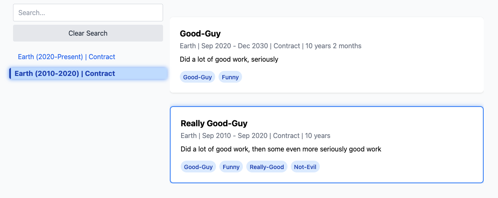

# techie

A collection of technical stuff that might be useful to others or not. 

The contents could consist of WTF's, code, meta-data, FYIs, Did You Know's, OMG This is Nuts, or anything technical that may pique the interest or not.

## [Docker build script to push images and manifest to repo](docker/multi-arch.md)

## [HTML Generator to display a CV or whatever](cv-gen/Readme.md)

