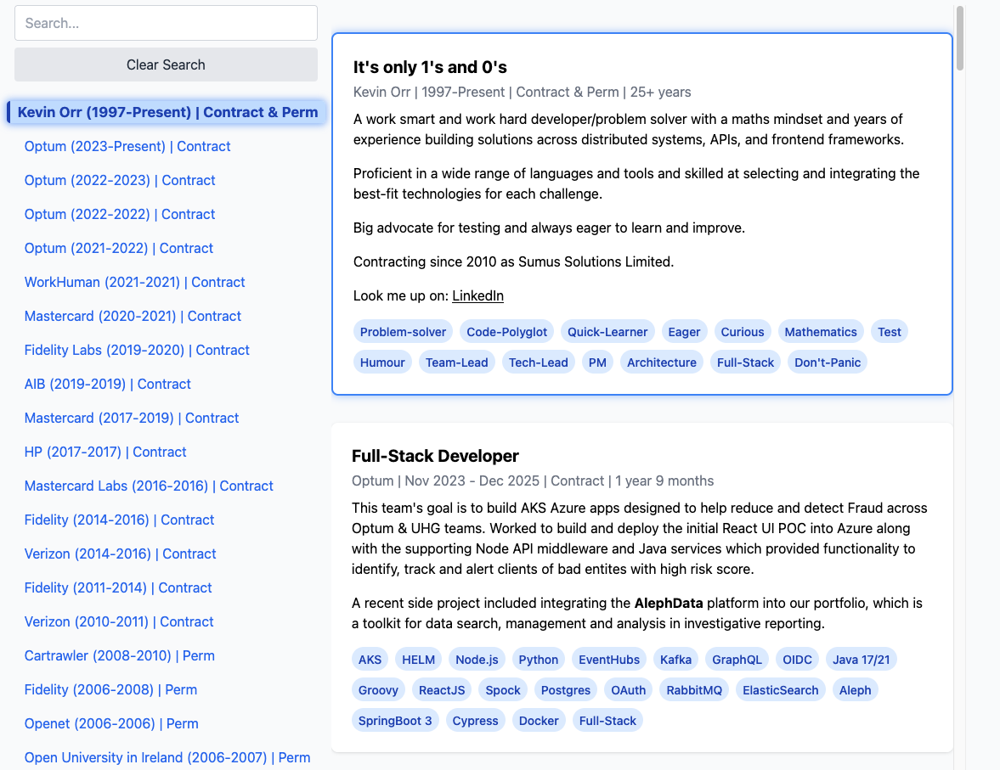

# techie

A collection of technical stuff that might be useful to others or not. 

The contents could consist of WTF's, code, meta-data, FYIs, Did You Know's, OMG This is Nuts, or anything technical that may pique the interest or not.

## [HTML Generator to display a CV or whatever](cv-gen/gen-cv.html)
This really came about because I was fed up with recruiters looking at my `LinkedIn` profile, reviewing my `CV` and still asking me if I had used this or that technology. 

I also had a domain `kevinorr.ie` which allowed me to install a file, but it had to be less than `15KB`, and use as a very simple web app. So I created this interactive CV browser and if anyone happened to hit my `kevinorr.ie` site they'd at least be able to see my CV!!

I bet it won't stop recruiters asking me the same questions over and over but hey hoy.

This is what my CV looks like - I used a Google Sheet to hold my CV and an extension to parse it into `JSON` - that way I can update my CV from there and the site will automatically get the updates.

